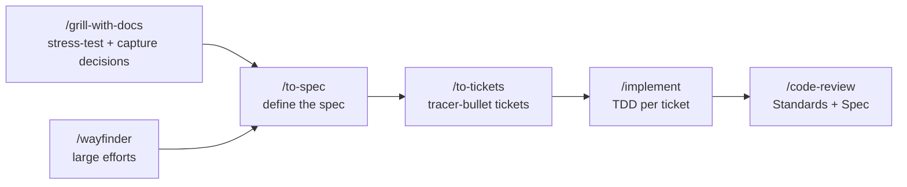

# pi-matt-pocock-skills

> Matt Pocock's engineering skills, bundled as a pi extension with parallel sub-agent support.

This extension is derived from [mattpocock/skills](https://github.com/mattpocock/skills) (MIT). It is a derivative work — not created by or endorsed by Matt Pocock.

## Installation

```bash
pi install npm:pi-matt-pocock-skills
```

After installing, restart pi to pick up the extension and bundled skills.

## What's included

### 12 skills

All skills from Matt Pocock's v1.1 engineering flow, ported verbatim with MIT attribution:

| Skill | Description |
|-------|-------------|
| `wayfinder` | Plan a large effort as a shared map of investigation tickets |
| `grill-with-docs` | The default entry — grilling coupled with glossary + ADR capture |
| `to-spec` | Turn the current conversation into a published spec |
| `to-tickets` | Break a spec into tracer-bullet tickets |
| `implement` | Implement a ticket with TDD |
| `code-review` | Two-axis review (Standards + Spec) via parallel sub-agents |
| `research` | Investigate a question against primary sources |
| `prototype` | Build a throwaway prototype to answer a design question |
| `grilling` | The core interview both `grill-with-docs` and wayfinder's grilling tickets build on |
| `domain-modeling` | Build and sharpen the project's domain vocabulary |
| `tdd` | Test-driven development reference |
| `setup-matt-pocock-skills` | Configure a repo for the engineering skills |

### Subagent tool

A vendored copy of pi's `subagent` tool (from pi v0.80.6 @ `34582ef`), registered automatically. Supports single, parallel, and chain modes for delegating tasks to specialized sub-agents.

### 5 agent definitions

| Agent | Purpose | Tools |
|-------|---------|-------|
| `standards-reviewer` | Checks code against documented standards + code smell baseline | read, grep, find, ls, bash |
| `spec-reviewer` | Checks code against the originating spec/issue/PRD | read, grep, find, ls, bash |
| `implementer` | Full-stack implementation with TDD | default |
| `scout` | Fast codebase recon producing structured findings for handoff | read, grep, find, ls, bash |
| `planner` | Produces concrete implementation plans from context | read, grep, find, ls |

### 3 workflow prompts

These are optional AFK shortcuts — see [Workflow](#workflow) for how they relate to the skill lifecycle and what each omits:

| Prompt | Flow |
|--------|------|
| `scout-plan-chain` | scout → planner (plan only) |
| `implement-chain` | scout → planner → implementer |
| `implement-review-chain` | implementer → standards-reviewer + spec-reviewer |

## Workflow

**First,** run `/setup-matt-pocock-skills` once per repo — it configures the issue tracker, triage labels, and domain docs the skills below consume.

### The lifecycle

The canonical flow is human-in-the-loop, one skill per stage:



`/grill-with-docs` is the default entry — it runs a `/grilling` interview while `/domain-modeling` captures the glossary (`CONTEXT.md`) and ADRs as decisions crystallise, so the pre-spec phase produces docs as a side-effect. `/wayfinder` is for efforts too big for one session — it charts the work as a shared map of tickets, resolves them one at a time, then hands the cleared route to `/to-spec`.

### Supporting skills

These slot in around the lifecycle (each line is *where* it fits — the table above says what it does):

- **`/grill-with-docs`** — the default entry; couples `/grilling` with `/domain-modeling`. `/wayfinder` also opens each grilling ticket with `/grill-with-docs`.
- **`/grilling`** — the core interview both `/grill-with-docs` and wayfinder's grilling tickets build on. Reach for it directly only when you want grilling without the docs overhead.
- **`/domain-modeling`** — captured automatically by `/grill-with-docs`; standalone when you're maintaining the model outside a grilling session.
- **`/research`** — a background agent for primary-source investigation, whenever the spec or a ticket needs it.
- **`/prototype`** — before the spec, when "how should it look / behave?" is the open question.
- **`/tdd`** — the red→green reference `/implement` follows; refactoring lives in `/code-review`, not the loop.

### Prompt chains (optional, AFK)

The `-chain` prompts are **optional shortcuts** — hand a tidy ticket to a sequence of sub-agents and step away. They are *not* co-equal with the skills above; each omits part of the human-in-the-loop discipline:

| Prompt | Flow | What it omits |
|--------|------|---------------|
| `/scout-plan-chain` | scout → planner | implementation — plan only |
| `/implement-chain` | scout → planner → implementer | the human seam-agreement — the implementer agrees its own TDD seams, so suit it to well-scoped tickets, not ones with open architectural choices |
| `/implement-review-chain` | implementer → standards-reviewer + spec-reviewer | the human seam-agreement (implementer is AFK) — the review step is now the **full two-axis** `/code-review`, not a lighter pass. |

### Naming rule

`/foo` = a **skill** the agent runs directly. `/foo-chain` = a **prompt** that delegates to a sequence of sub-agents.

## Attribution

The 12 skills are derived from [mattpocock/skills](https://github.com/mattpocock/skills) @ `d574778`, licensed under MIT (Copyright 2026 Matt Pocock). Each SKILL.md carries a per-file attribution header, and the `NOTICE` file lists all derived files. See `UPSTREAM-CHANGES.md` for the delta record.

The `subagent` tool (`src/subagent/`) is vendored from `@earendil-works/pi-coding-agent` v0.80.6 @ `34582ef`, licensed under MIT (Copyright 2026 earendil-works). See `src/subagent/UPSTREAM.md` for details.

## License

MIT — see [LICENSE](./LICENSE).